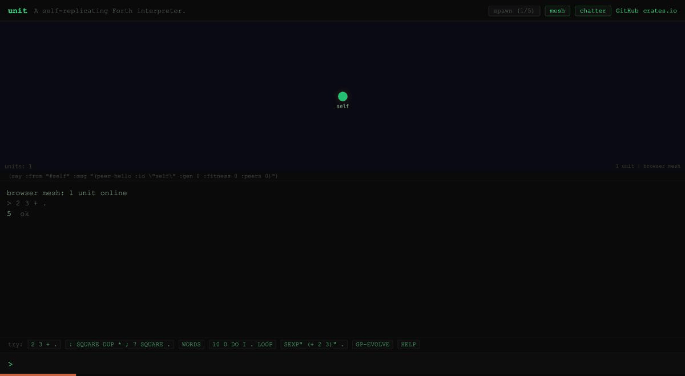

# unit

**A self-replicating software nanobot** — a minimal Forth interpreter that is also a networked mesh agent.



**[Try the live demo](https://davidcanhelp.github.io/unit/)** | **Install**: `cargo install unit`

[](https://github.com/DavidCanHelp/unit/actions/workflows/ci.yml)

## What Happens

```
$ unit
unit v0.28.0 -- seed online
Mesh node a1b2c3d4e5f67890 gen=0 peers=0 fitness=0
> 2 3 + .
5  ok
> : SQUARE DUP * ;
 ok
> 7 SQUARE .
49  ok
> SPAWN
spawned child pid=12345 id=cafe0123deadbeef
> SEXP" (* 6 7)" .
42  ok
```

## The Idea

What's the smallest piece of software that can reproduce and improve itself?

A Forth interpreter. The dictionary IS the genome. The words the unit
runs are the words it evolves. There's no separation between genotype
and phenotype — the code is the organism. You can inspect it (`SEE`),
mutate it (`SMART-MUTATE`), share it (`SHARE-ALL`), and spawn a child
that inherits all of it (`SPAWN`).

Everything else grew from there.

## The Five Concerns

| Concern | Mechanism |
|---------|-----------|
| **Execute** | Forth VM — stacks, dictionary, inner interpreter |
| **Communicate** | S-expression mesh protocol over UDP gossip |
| **Replicate** | Reads own binary, packages state, spawns child processes |
| **Mutate** | Genetic programming — 50 candidates, tournament selection, 5 mutation operators |
| **Persist** | JSON snapshots — hibernate, resurrect, automatic restoration on startup |

These five concerns are the kernel. Everything below emerged from them.

## The Layers

### Layer 1: The Kernel

The Forth VM gives the unit a brain: stacks, a dictionary, and an inner
interpreter that can define new words at runtime. UDP gossip gives it a
voice — units discover each other, share words, and broadcast
S-expressions that any language can parse. Self-replication reads the
unit's own binary, serializes its state into a UREP package, and spawns
a child process that boots with the parent's entire dictionary. The
mutation engine applies token-level operations (swap, insert, delete,
replace, double) to dictionary entries, with benchmarking to keep
beneficial changes and revert harmful ones. JSON persistence lets a unit
hibernate and resurrect exactly where it left off.

This is what fits in a 1.2 MB binary with zero dependencies.

### Layer 2: Emergent Behavior

The immune system came first. When a unit can't solve a problem, it
registers the failure as a fitness challenge and broadcasts it to the
mesh. Every unit evolves solutions in parallel. The first solution that
passes verification is installed as a dictionary word (SOL-*) that
children inherit. Solved challenges generate harder ones — fib(10) leads
to fib(15) leads to fib(20), with parsimony pressure rewarding shorter
programs.

Metabolic energy makes it real. Every operation costs something: spawning
costs 200, each GP generation costs 5, even mesh messages cost 1. Units
that run out are throttled. Children inherit a fraction of the parent's
energy. Reproduction is a metabolic investment.

Then three orders of evolution emerged. The GP engine evolves solutions
(first-order). A MetaEvolver maintains a population of Forth programs
that generate new challenges from solved ones (second-order). A
ScoringPopulation evolves the functions that judge whether generated
challenges are good (third-order). Use `META-DEPTH` to see all three
levels operating simultaneously.

Sexual reproduction followed. `MATE` selects a partner through
tournament selection, and both parents contribute dictionary words to the
child — shared words from the fitter parent, unique words with 50%
probability, antibodies always preserved. Niche construction lets units
that excel at certain challenge types see more of those challenges,
creating ecological specialization across the colony.

Then signaling. Units gained the ability to *say something to other
units because they chose to* — `SAY!` broadcasts a value to neighbors'
inboxes, `LISTEN` drains them, `MARK!`/`SENSE` deposit and read from a
per-host environmental field keyed by niche. Mate selection now reads
the inbox: a peer that broadcast `FITNESS SAY!` (the `COURT` prelude)
gets weighted into the tournament. Honesty is not enforced — `SAY!`
costs energy but the value broadcast is whatever the dictionary chose,
which makes signal stability an empirical question. See
[docs/signaling.md](docs/signaling.md).

None of this was planned from the start. It emerged from asking "what
should a self-improving organism do next?"

### Layer 3: The Colony

Three species coexist on one mesh: Rust/Forth units with token-sequence
genomes, Go organisms with expression trees, and Python organisms with
AST-based symbolic regression. They speak the same S-expression protocol,
receive the same challenges, and broadcast solutions using their own GP
strategies. Different cognitive substrates, same evolutionary pressures.

Distributed computation fans sub-goals across the mesh as S-expressions.
If a peer doesn't respond, the unit falls back to local computation.
Swarm mode enables auto-discovery, word sharing, and autonomous
spawn/cull with a single command.

## Try It

```
> 2 3 + .                              \ basic arithmetic
5  ok
> : SQUARE DUP * ;                     \ define a word
 ok
> SPAWN                                \ replicate
spawned child pid=12345 id=cafe0123deadbeef
> SEXP" (* 6 7)" .                     \ S-expression eval
42  ok
> GP-EVOLVE                            \ evolve a solution
[gen 0] WINNER: "0 1 10 0 DO OVER + SWAP LOOP DROP ." (fitness=890)
> CHALLENGES                           \ see the immune system
--- 4 challenges ---
  #1 fib10 [SOLVED] reward=100
> ENERGY                               \ check metabolism
energy: 1097/5000 (earned: 102, spent: 5, efficiency: 20.40)
> MATE                                 \ sexual reproduction
mating with #cafe (fitness=45)...
> NICHE                                \ ecological profile
--- niche profile ---
  fibonacci: 100% (modifier: 2.0x)
```

See [docs/words.md](docs/words.md) for the complete word reference (315 words).

## Interfaces

### HTTP Bridge

Still zero dependencies. A hand-rolled HTTP/1.1 server exposes the VM
and mesh over localhost so menu bar apps, web UIs, MCP servers,
AppleScript, and Shortcuts can talk to a unit without speaking Forth.

```
$ unit --serve 9898 &
http: listening on http://127.0.0.1:9898

$ curl -s -X POST http://127.0.0.1:9898/eval \
       -d '{"source": "2 3 + ."}'
{"output":"5 "}

$ curl -s -X POST http://127.0.0.1:9898/sexp \
       -d '{"expr": "(* 6 7)"}'
{"result":"42"}

$ curl -s http://127.0.0.1:9898/status
{"id":"cafe0123deadbeef","fitness":0,"energy":1000,"peers":3,"words":314,"generation":0}
```

Build with `cargo build --features http`. Bind is 127.0.0.1 only; no
auth, no keep-alive. Endpoints: `POST /eval`, `POST /sexp`,
`GET /status`, `GET /words`, `GET /word/<n>`, `GET /mesh/peers`,
`POST /mesh/broadcast`. Errors come back as `{"error":"..."}`.

## Deployment Modes

unit ships two deployment models. They share the same wire protocol
and interoperate on the mesh.

**Single VM per process** (legacy, default). One unit, one OS
process, one mesh node. Spawning is `fork + exec` of a fresh child;
mesh peers are units. Fork-level isolation — a crash in one unit
cannot affect others. Reach for this when isolation matters more than
scale.

```
$ unit --port 9001
```

**Multi-unit per process** (two-tier, opt-in via `--multi-unit N`).
Many cheap in-process VMs in a `MultiUnitHost`; the process is the
mesh peer. Per-unit memory drops from the ~5–10 MB of a forked
process to ~165 kB; spawning is a `Vec<VM>` push instead of
`fork + exec`. Bounded-k random gossip (enabled with `--gossip-k 8`)
caps per-process heartbeat and chatter bandwidth at O(k) instead of
O(M); without the flag, the legacy all-to-all path is used. Crash
semantics are fate-shared at the host level — if a process dies, its
units die with it. Reach for this when scale matters more than
fork-level isolation.

Two processes, each running 5 in-process units, peered on loopback:

```
$ unit --multi-unit 5 --port 9001 --gossip-k 8 -q &
$ unit --multi-unit 5 --port 9002 --peers 127.0.0.1:9001 --gossip-k 8 -q

=== unit --multi-unit 5 --port 9002 ===
host id: ebc1eacccc28ea52  port: 9002  units: 5

listening for peers (5s)...
[recv] from 15d15326e643aa64 → unit #0 → 42

--- discovered remote processes ---
  host 15d15326e643aa64 @ 127.0.0.1:9001  units=5

--- per-unit Forth queries (unit #0) ---
  HOST-ID            → ebc1eacccc28ea52
  SIBLING-COUNT      → 4
  MESH-PROCESS-COUNT → 1

--- cross-process send to 15d15326e643aa64 ---
  sent: `21 2 * .`
```

Process A (port 9001) sent `21 2 * .` to B during its own discovery
window; B's `[recv]` line shows it arrived, was dispatched to B's
unit #0 via least-busy worker selection, and evaluated to `42`. B
then sends back to A in the same way. Each unit can query its host
identity, sibling count, and remote-process count from Forth via
`HOST-ID`, `SIBLING-COUNT`, and `MESH-PROCESS-COUNT`.

Discovery is timing-dependent. The `[recv]` line only appears if A's
5-second discovery window is still open when B announces itself. The
`&` in the commands above starts A first so this usually wins; if
you see no recv line, re-run with B started immediately after A.

Today's bench tops out at 10 000 aggregate units on single-host
loopback. The architecture supports the path further; the next walls
(in-process scheduler fairness, async eval, multi-machine validation)
are explicit in [docs/ARCHITECTURE.md](docs/ARCHITECTURE.md).

## Architecture

```
src/
├── vm/               # Forth virtual machine (~200 primitives)
├── mesh.rs           # UDP gossip, peer discovery, bounded-k fan-out
├── multi_unit.rs     # In-process multi-unit host + mesh bridge
├── metrics.rs        # Lightweight timing + counter histograms
├── sexp.rs           # S-expression parser and serializer
├── evolve.rs         # Genetic programming engine
├── challenges.rs     # Challenge registry (immune system)
├── energy.rs         # Metabolic energy system
├── landscape.rs      # Dynamic fitness landscape, meta-evolution
├── reproduction.rs   # Sexual reproduction, dictionary crossover
├── niche.rs          # Niche construction, ecological specialization
├── spawn.rs          # Self-replication, UREP package format
├── snapshot.rs       # JSON persistence and resurrection
├── http.rs           # HTTP bridge (opt-in via --features http)
├── prelude.fs        # Forth prelude (~600 lines)
└── main.rs           # REPL, CLI, feature wiring

polyglot/go/          # Go organism (expression trees)
polyglot/python/      # Python organism (AST symbolic regression)
```

The kernel is ~2,000 lines. The organism is ~36,000. Both are intentional.

255+ Rust tests, 22 Python tests, Go tests. Zero dependencies.

## Documentation

- [docs/words.md](docs/words.md) — complete word reference (315 words)
- [docs/protocol.md](docs/protocol.md) — S-expression wire format and mesh protocol
- [docs/operations.md](docs/operations.md) — monitoring, goals, trust, persistence, swarm mode
- [docs/ARCHITECTURE.md](docs/ARCHITECTURE.md) — two-tier deployment design rationale and bench results
- [docs/signaling.md](docs/signaling.md) — inter-unit signaling design (v0.28)

## Binary Sizes

| Target | Size |
|--------|------|
| Native (macOS arm64, release) | ~1.2 MB |
| WASM (browser) | ~338 KB |

## License

MIT — see [LICENSE](LICENSE).
